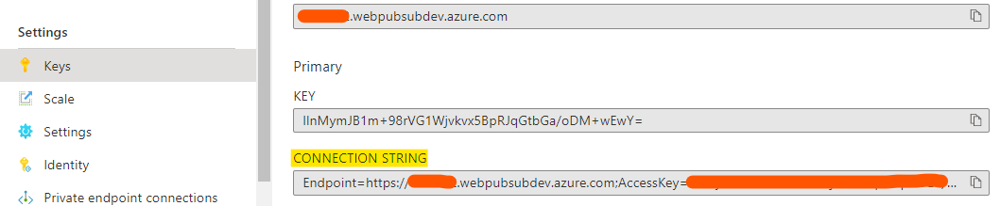

# Create a Chat app

## Overall Steps
1. Create an Azure Resource Group
2. Create an Azure Web App
3. Create an Azure PubSub Service
4. Link the Azure PubSub Service with the Azure Web App
5. Deploy the code to the Azure Web App


## Create an Azure Ressource Group

Open the Azure Portal and create a resource group according to the following naming scheme:
```cloud-school-foundation-[YOUR-NAME]```
Deploy the resource group in the West Europe Region. 

## Create an Azure Web App

1. Open the Azure Portal, go the marketplace and search for "Web App".
2. Select Web App and add the following information:
   * Resource Group: Select the previous created resource group
   * Name: Choose a name according the following naming scheme: ```cloud-school-foundation-webapp-[YOUR-NAME]```
   * Publish: Code
   * Runtime Stack: Node 14 LTS
   * Operating System: Linux
   * Region: West Europe
   * App Service Plan: Create a new one and for SKU and Size select B1 (Basic Plan)
3. Click on "Review + Create" and create the Web App

## Create an Azure PubSub Service
1. Open the Azure Portal, go the marketplace and search for "PubSub". Select "Web PubSub Service". 
2. Add the following information:
    * Resource Group: Select the previous created resource group
    * Name: Choose a name according the following naming scheme: ```cloud-school-foundation-pubsub-[YOUR-NAME]```
    * Region: West Europe
    * Pricing Tier: Free (Dev / Test)
    * Unit count: 1
3. Click on "Review + Create" and create the Web PubSub Service

## Link the Azure PubSub Service with the Azure Web App
1. Open your Web PubSub Service in the Azure Portal, go to the "Keys Tab" in the Settings Menu and copy the full Connection String under Primary.
   
2. Open your Web App in the Azure Portal, go to the "Configuration Tab" in the Settings Menu and add a new application setting. Name it "WebPubSubConnectionString" (exact naming, otherwise it will not work). The value is the previously copied connection string. 
3. Go back to the "Overview Tab" in your Web App and copy the URL on the upper right. 
4. Open your Web PubSub Service in the Azure Portal, go to the "Settings Tab" in the Settings Menu and add an Event Handler Setting for the Hub. Name it "chat" (exact naming, otherwise it will not work).
5. Add a URL Template with the following values and click on save:
    * URL Template: [Copied-Web-App-URL]/eventhandler
    * User Event Pattern: *
    * System Events: connected

## Deploy the code to the Azure Web App
1. Open your Web App in the Azure Portal, go to the "Deployment Center Tab" in the Deployment Menu and select "External Git" as Source. Paste the following URL into the Repository field: https://github.com/tobim-dev/mw-cloud-school. Leave the other two settings as default.
2. Click on Save and wait a few minutes for the app to be deployed. If everythings correct, you can go to your Web App's "Overview Tab", copy the URL presented on the upper right and open it in your browser. You should now see your Chat App.
